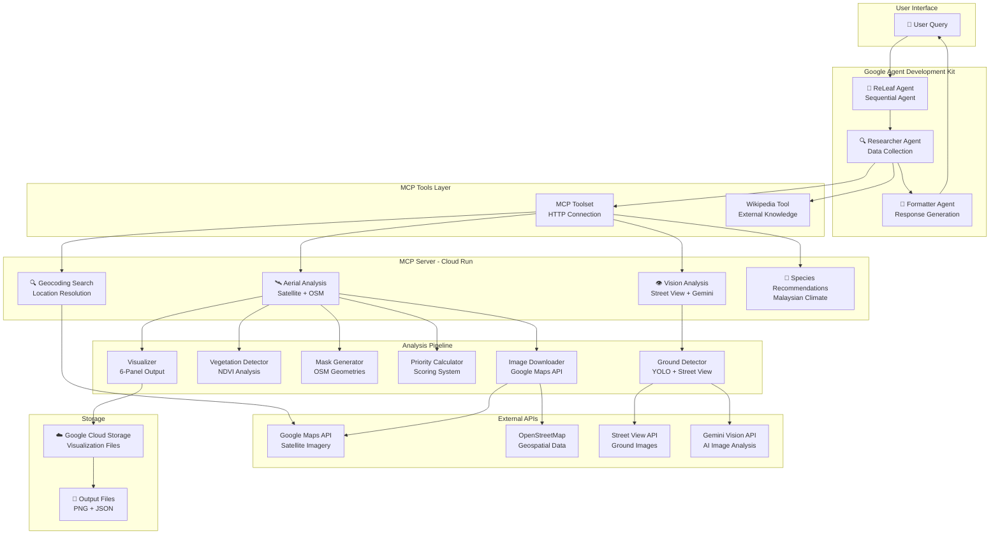
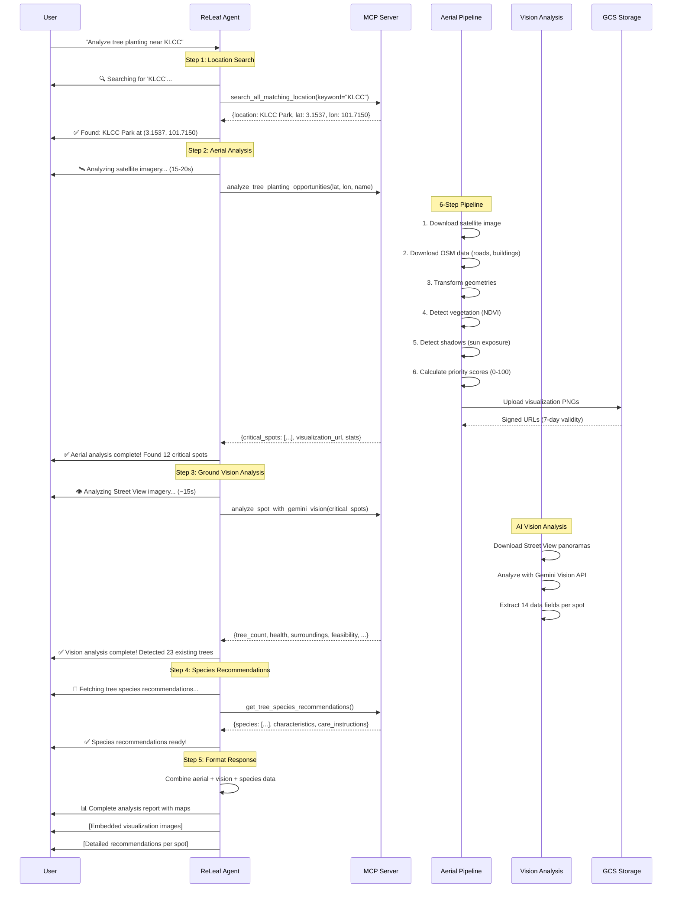

# 🌳 ReLeaf: AI Tree Planting Advisor Agentic System

An intelligent AI-powered system that identifies optimal tree planting locations in urban environments using satellite imagery analysis, ground-level validation, and multi-agent orchestration powered by Google Agent Development Kit (ADK).

---

## 📋 Table of Contents

- [High-Level Architecture](#high-level-architecture)
- [Process Flow](#process-flow)
- [Core Functions](#core-functions)
- [Folder Structure](#folder-structure)
- [System Architecture](#system-architecture)
- [Usage](#usage)
- [Installation](#installation)
- [Technical Stack](#technical-stack)

---

## 🏗️ High-Level Architecture



---

## 🔄 Process Flow

### Complete Analysis Workflow



### Data Flow Per Analysis Stage

```
┌─────────────────────────────────────────────────────────────┐
│                   STAGE 1: LOCATION SEARCH                  │
│  Input: "KLCC Park" → Output: lat/lon coordinates          │
└─────────────────────────────────────────────────────────────┘
                            ↓
┌─────────────────────────────────────────────────────────────┐
│                   STAGE 2: AERIAL ANALYSIS                  │
│                                                             │
│  Satellite Image (640x640) + OSM Data                      │
│         ↓                                                   │
│  NDVI Calculation (vegetation detection)                   │
│         ↓                                                   │
│  Shadow Detection (sun exposure patterns)                  │
│         ↓                                                   │
│  Priority Scoring (per pixel, 0-100 scale)                │
│         ↓                                                   │
│  Output: 12 critical spots (score ≥ 80)                   │
│          6-panel visualization PNG                         │
│          GPS coordinates for each spot                     │
└─────────────────────────────────────────────────────────────┘
                            ↓
┌─────────────────────────────────────────────────────────────┐
│                STAGE 3: GROUND VISION ANALYSIS              │
│                                                             │
│  Street View Images (per critical spot)                    │
│         ↓                                                   │
│  Gemini Vision AI Analysis                                 │
│         ↓                                                   │
│  Extract 14 Context Fields:                                │
│    • Tree count (existing, mature, young)                 │
│    • Tree health & species hints                          │
│    • Surroundings (buildings, shops, traffic)            │
│    • Sidewalk space & obstacles                           │
│    • Sunlight exposure patterns                           │
│    • Planting feasibility (high/medium/low)              │
│    • Recommended tree count & spacing                     │
│         ↓                                                   │
│  Output: Context-aware planting recommendations           │
└─────────────────────────────────────────────────────────────┘
                            ↓
┌─────────────────────────────────────────────────────────────┐
│                STAGE 4: SPECIES RECOMMENDATION              │
│                                                             │
│  Malaysian Climate Data                                     │
│         ↓                                                   │
│  5 Recommended Species:                                    │
│    • Rain Tree (Samanea saman)                            │
│    • Angsana (Pterocarpus indicus)                        │
│    • Yellow Flame (Peltophorum pterocarpum)              │
│    • Sea Apple (Syzygium grande)                          │
│    • Trumpet Tree (Tabebuia rosea)                        │
│         ↓                                                   │
│  Output: Care instructions, water needs, mature size      │
└─────────────────────────────────────────────────────────────┘
```

---

## ⚙️ Core Functions

### 1. **Location Search & Geocoding**
**Tool:** `search_all_matching_location_based_on_keyword`

```python
# Converts location names to GPS coordinates
Input: "Menara LGB, Kuala Lumpur"
Output: {
    "Menara LGB KLCC": (3.1379, 101.6294),
    "Menara LGB, Jalan Tun Razak": (3.1635, 101.7211)
}
```

**Features:**
- Google Geocoding API integration
- Returns multiple matches for disambiguation
- Provides exact lat/lon for analysis

---

### 2. **Aerial Analysis Pipeline**
**Tool:** `analyze_tree_planting_opportunities`

**6-Step Processing Pipeline:**

#### Step 1: Satellite Image Download
- Downloads 640x640px high-resolution satellite imagery
- Uses Google Maps Static API
- Zoom level 19 for detailed urban analysis

#### Step 2: OSM Data Download
- Fetches road networks (primary, secondary, residential)
- Downloads building footprints
- Retrieves water bodies and parks
- Collects amenity data (schools, hospitals, malls)

#### Step 3: Geometry Transformation
- Converts lat/lon to pixel coordinates
- Aligns OSM geometries with satellite image
- Creates spatial masks for analysis

#### Step 4: Vegetation Detection
- **NDVI (Normalized Difference Vegetation Index):**
  ```
  NDVI = (Green - Red) / (Green + Red)
  ```
- Identifies existing vegetation coverage
- Threshold: NDVI > 0.1 = vegetation
- Brightness filter: V > 50 (excludes shadows)

#### Step 5: Shadow Detection
- Analyzes HSV color space
- Identifies sun-exposed vs. shaded areas
- Formula: Dark (V < 90) AND Desaturated (S < 50)
- Excludes vegetation from shadow classification

#### Step 6: Priority Scoring
- **Composite score (0-100 scale):**
  - **Sidewalk proximity** (30%): Distance to pedestrian paths
  - **Building proximity** (20%): Near buildings for shade/aesthetics
  - **Sun exposure** (25%): Shadow-free areas (better growth)
  - **Amenity proximity** (25%): Near schools, hospitals, parks

**Output:**
```json
{
  "location_name": "Menara LGB",
  "critical_priority_spots": [
    {
      "spot_id": 1,
      "coordinates": {"latitude": 3.13792, "longitude": 101.62947},
      "priority_score": 95.2,
      "area_m2": 142.5,
      "google_street_view_url": "...",
      "google_maps_url": "..."
    }
  ],
  "land_coverage": {
    "total_area_m2": 256000,
    "plantable_area_m2": 38400,
    "vegetation_coverage_pct": 23.5,
    "shadow_coverage_pct": 31.2
  },
  "priority_distribution": {
    "critical_priority_pct": 4.7,  // Score 80-100
    "high_priority_pct": 8.3,      // Score 60-79
    "medium_priority_pct": 12.1,   // Score 40-59
    "low_priority_pct": 75.0       // Score 0-39
  },
  "visualization_urls": {
    "analysis_map": "https://storage.googleapis.com/.../analysis.png",
    "component_breakdown": "https://storage.googleapis.com/.../components.png"
  }
}
```

**Visualization Output:**
- **6-Panel Analysis PNG:**
  1. Satellite imagery (original)
  2. Priority heatmap (color-coded zones)
  3. Vegetation mask (green overlay)
  4. Shadow mask (sun exposure)
  5. Combined masks (roads, buildings, water)
  6. Critical spots highlighted (red markers)

---

### 3. **Ground-Level Vision Analysis**
**Tool:** `analyze_spot_with_gemini_vision`

**Process:**
1. Downloads Street View panorama for each critical spot
2. Sends image to Gemini Vision API with structured prompt
3. Extracts 14 contextual data fields per location

**Gemini Vision Analysis Fields:**
```json
{
  "spot_number": 1,
  "location": {"lat": 3.1379, "lon": 101.6294},
  "analysis": {
    "tree_count": 3,
    "mature_trees": 2,
    "young_trees": 1,
    "tree_health": "good - healthy canopy, no visible disease",
    "tree_species_hints": ["Rain tree (large canopy)", "Angsana (reddish leaves)"],
    "surroundings": "Commercial buildings (3-4 stories), retail shops on ground floor",
    "road_characteristics": "2-lane road, moderate traffic, asphalt in good condition",
    "sidewalk_space": "2.5m wide sidewalk, some tree grates already installed",
    "sunlight_exposure": "Morning sun, afternoon shade from west-side buildings",
    "obstacles": ["Utility pole", "Storm drain", "Street sign"],
    "planting_feasibility": "medium",
    "recommended_tree_count": 2,
    "spacing_suggestion": "8-10 meters apart",
    "planting_recommendations": [
      "Fill gap between existing trees",
      "Use medium-sized species (10-15m mature height)",
      "Install tree grates for root protection",
      "Consider shade-tolerant species due to afternoon shade"
    ]
  }
}
```

**Key Insights Provided:**
- Existing tree inventory and health status
- Urban context (commercial, residential, mixed-use)
- Physical constraints (poles, drainage, pavement)
- Sunlight patterns (important for species selection)
- Practical planting recommendations

---

### 4. **Tree Species Recommendations**
**Tool:** `get_tree_species_recommendations`

Returns 5 Malaysian native/adapted species with detailed care info:

| Species | Height | Canopy | Water Absorption | Best Planting |
|---------|--------|--------|------------------|---------------|
| **Rain Tree** | 25-30m | 30-40m | Very High (800L/day) | Feb-Apr |
| **Angsana** | 20-30m | 15-25m | High (500L/day) | Mar-May |
| **Yellow Flame** | 15-25m | 10-15m | Medium (350L/day) | Jan-Mar |
| **Sea Apple** | 15-20m | 10-12m | High (450L/day) | Apr-Jun |
| **Trumpet Tree** | 20-25m | 12-18m | Medium (400L/day) | Nov-Feb |

**Selection Criteria:**
- Climate suitability (tropical, high humidity)
- Urban tolerance (pollution, compacted soil)
- Maintenance requirements
- Ecological benefits (shade, water absorption, biodiversity)

---

## 📁 Folder Structure

```
ReLeaf_Agent/
├── README.md                          # This file
├── requirements.txt                   # Agent dependencies
├── agent.py                           # Main agent orchestration
├── .env                              # Environment variables (API keys)
│
└── mcp/                              # MCP Server Package
    ├── Dockerfile                     # Cloud Run deployment
    ├── pyproject.toml                 # MCP server dependencies
    ├── server.py                      # FastMCP server with 4 tools
    ├── geocoding_search.py            # Location search implementation
    ├── test_server.py                 # Unit tests
    │
    └── urban_tree_planting/           # Analysis Pipeline Package
        ├── heatmap_README.md
        ├── GROUND_DETECTION_README.md
        │
        ├── config/                    # Configuration
        │   ├── __init__.py
        │   ├── settings.py            # Analysis parameters
        │   └── locations.json         # Pre-defined locations
        │
        ├── core/                      # Core processing modules
        │   ├── __init__.py
        │   ├── detector.py            # NDVI & shadow detection
        │   ├── downloader.py          # Image & OSM data fetching
        │   ├── mask_generator.py      # Geometry masking
        │   ├── priority_calculator.py # Scoring algorithm
        │   ├── transformer.py         # Coordinate transformation
        │   ├── visualizer.py          # PNG visualization generation
        │   └── ground_tree_detector.py # Street View + Gemini Vision
        │
        ├── models/                    # Data models
        │   ├── __init__.py
        │   └── location.py            # Location class definition
        │
        ├── pipeline/                  # Orchestration
        │   ├── __init__.py
        │   └── processor.py           # TreePlantingPipeline class
        │
        ├── scripts/                   # Standalone scripts
        │   └── run_analysis.py        # CLI tool for batch processing
        │
        ├── utils/                     # Utilities
        │   ├── __init__.py
        │   ├── geo_utils.py           # Geospatial calculations
        │   └── logger.py              # Logging configuration
        │
        └── examples/                  # Usage examples
            └── ground_detection_example.py
```

---

## 🏛️ System Architecture

### Technology Stack

#### **1. Agent Framework**
- **Google Agent Development Kit (ADK) v1.14.0**
  - Sequential agent pattern
  - Tool orchestration
  - State management
  - Multi-agent coordination

#### **2. MCP Server**
- **FastMCP v2.11.2**
  - HTTP/SSE transport
  - Tool registration & discovery
  - Cloud Run deployment
  - Bearer token authentication

#### **3. Geospatial Processing**
- **OSMnx v1.2.0** - OpenStreetMap data extraction
- **GeoPandas v0.10.0** - Geospatial data manipulation
- **Shapely v1.8.0** - Geometric operations
- **NumPy v1.21.0** - Array operations
- **SciPy v1.7.0** - Scientific computing

#### **4. Image Processing**
- **OpenCV v4.5.0** - Computer vision operations
- **Pillow v9.0.0** - Image manipulation
- **Matplotlib v3.5.0** - Visualization generation

#### **5. AI & ML**
- **Gemini 2.5 Flash** - Ground-level image analysis
- **Gemini Vision API** - Ground-level image analysis
- **Vertex AI** - Model hosting

#### **6. External APIs**
- **Google Maps Static API** - Satellite imagery
- **Google Geocoding API** - Location resolution
- **Google Street View API** - Ground-level panoramas
- **OpenStreetMap Overpass API** - Geospatial data

#### **7. Cloud Infrastructure**
- **Google Cloud Run** - Serverless MCP hosting
- **Google Cloud Storage** - Visualization file storage
- **Google Secret Manager** - API key management

---

### Component Interaction

```
┌──────────────────────────────────────────────────────────────┐
│                     AGENT LAYER                              │
│  • Google ADK Sequential Agent                              │
│  • Researcher Agent (data collection)                       │
│  • Formatter Agent (response generation)                    │
│  • State management (PROMPT storage)                        │
└──────────────────────────────────────────────────────────────┘
                            ↕️
┌──────────────────────────────────────────────────────────────┐
│                    TOOL LAYER                                │
│  • MCP Toolset (HTTP connection to Cloud Run)              │
│  • Wikipedia Tool (external knowledge)                      │
│  • 300-second timeout for long-running analysis            │
└──────────────────────────────────────────────────────────────┘
                            ↕️
┌──────────────────────────────────────────────────────────────┐
│                   MCP SERVER LAYER                           │
│  • FastMCP server on Cloud Run                              │
│  • 4 registered tools:                                      │
│    1. search_all_matching_location_based_on_keyword        │
│    2. analyze_tree_planting_opportunities                  │
│    3. analyze_spot_with_gemini_vision                      │
│    4. get_tree_species_recommendations                     │
│  • Bearer token authentication (Google ID tokens)          │
└──────────────────────────────────────────────────────────────┘
                            ↕️
┌──────────────────────────────────────────────────────────────┐
│                 PROCESSING LAYER                             │
│  • TreePlantingPipeline (6-step orchestration)             │
│  • VegetationDetector (NDVI calculation)                   │
│  • MaskGenerator (OSM geometry processing)                 │
│  • PriorityCalculator (scoring algorithm)                  │
│  • ResultVisualizer (PNG generation)                       │
│  • GroundLevelDetector (Street View + Gemini)             │
└──────────────────────────────────────────────────────────────┘
                            ↕️
┌──────────────────────────────────────────────────────────────┐
│                  EXTERNAL APIS                               │
│  • Google Maps (satellite images)                           │
│  • OpenStreetMap (geospatial data)                         │
│  • Google Street View (ground photos)                      │
│  • Gemini Vision (AI analysis)                             │
└──────────────────────────────────────────────────────────────┘
                            ↕️
┌──────────────────────────────────────────────────────────────┐
│                     STORAGE                                  │
│  • Google Cloud Storage (visualization PNGs)               │
│  • Signed URLs (7-day validity)                            │
│  • /tmp directory (Cloud Run ephemeral storage)           │
└──────────────────────────────────────────────────────────────┘
```

---

### Deployment Architecture

```
┌─────────────────────────────────────────────────────────────┐
│                      Google Cloud Platform                  │
│                                                             │
│  ┌──────────────────────────────────────────────────────┐  │
│  │         Cloud Run Service (MCP Server)               │  │
│  │  • Container: releaf-mcp-server:latest              │  │
│  │  • Memory: 2GB                                      │  │
│  │  • CPU: 2 vCPU                                      │  │
│  │  • Timeout: 300s                                    │  │
│  │  • Concurrency: 10                                  │  │
│  │  • Authentication: Require authentication          │  │
│  └──────────────────────────────────────────────────────┘  │
│                          ↕️                                  │
│  ┌──────────────────────────────────────────────────────┐  │
│  │         Cloud Storage Bucket                         │  │
│  │  • Bucket: releaf-analysis-outputs                  │  │
│  │  • Signed URLs (7-day expiry)                       │  │
│  │  • Public read access (via signed URLs)            │  │
│  └──────────────────────────────────────────────────────┘  │
│                          ↕️                                  │
│  ┌──────────────────────────────────────────────────────┐  │
│  │         Secret Manager                               │  │
│  │  • GOOGLE_MAPS_API_KEY                              │  │
│  │  • Service Account Keys                             │  │
│  └──────────────────────────────────────────────────────┘  │
│                          ↕️                                  │
│  ┌──────────────────────────────────────────────────────┐  │
│  │         Vertex AI (Gemini Vision)                    │  │
│  │  • Model: gemini-1.5-flash                          │  │
│  │  • Vision analysis with structured prompts          │  │
│  └──────────────────────────────────────────────────────┘  │
└─────────────────────────────────────────────────────────────┘
                            ↕️
┌─────────────────────────────────────────────────────────────┐
│                    Local Environment                        │
│  • Python script running agent.py                          │
│  • Google ADK handles agent orchestration                  │
│  • HTTP connection to Cloud Run MCP server                 │
└─────────────────────────────────────────────────────────────┘
```

---

## 🚀 Usage

### Prerequisites

1. **Python 3.10+**
2. **Google Cloud Account**
   - Project with billing enabled
   - APIs enabled: Maps, Geocoding, Street View, Vertex AI
3. **API Keys:**
   - Google Maps API key
   - MCP Server URL (Cloud Run endpoint)

### Environment Setup

Create `.env` file in `ReLeaf_Agent/`:

```bash
# Agent Configuration
MODEL=gemini-2.0-flash-exp
MCP_SERVER_URL=https://your-mcp-server-url.run.app/mcp/sse

# Google Cloud
GOOGLE_MAPS_API_KEY=your_google_maps_api_key_here
GCP_PROJECT=your-gcp-project-id
```

### Running the Agent

#### Method 1: Direct Python Execution

```bash
# Navigate to agent directory
cd ReLeaf_Agent

# Install dependencies
pip install -r requirements.txt

# Run the agent
python agent.py
```

#### Method 2: Interactive Session

```python
from agent import agent_root

# Run analysis
result = agent_root.run("Analyze tree planting opportunities near Menara LGB, Kuala Lumpur")

print(result)
```

### Example Queries

```python
# Basic location analysis
"Analyze tree planting near KLCC Park"

# Specific building/landmark
"Find tree planting spots around Menara LGB"

# Large area analysis
"Identify tree planting opportunities in Petaling Jaya"

# Species-specific query
"What trees grow well near Sunway Pyramid?"

# Combined with Wikipedia knowledge
"Analyze tree planting at Batu Caves and tell me about rain trees"
```

### Expected Output

```
🔍 Searching for 'Menara LGB'...
✅ Found: Menara LGB KLCC at (3.1379, 101.6294)

🛰️ Analyzing satellite imagery and vegetation patterns... (15-20 seconds)
✅ Aerial analysis complete! Found 12 critical priority spots for tree planting.

👁️ Analyzing ground-level Street View imagery with AI vision... (~15 seconds)
✅ Vision analysis complete! Detected 23 existing trees across 5 spots.

🌳 Fetching recommended tree species for Kuala Lumpur climate...
✅ Species recommendations ready! Preparing comprehensive report...

━━━━━━━━━━━━━━━━━━━━━━━━━━━━━━━━━━━━━━━━━━━━━━━━
✅ **Analysis Complete!** 
   Tree Planting Report for Menara LGB
━━━━━━━━━━━━━━━━━━━━━━━━━━━━━━━━━━━━━━━━━━━━━━━━

📊 **Detailed Analysis Visualization**


🎯 **Critical Priority Spots (Score ≥ 80)**

**Spot 1** - Priority Score: 95.2 (CRITICAL)
├─ Location: 3.13792°N, 101.62947°E
├─ Area: 142.5 m²
├─ Existing Trees: 3 (2 mature, 1 young)
├─ Tree Health: Good - healthy canopy
├─ Surroundings: Commercial buildings, retail shops
├─ Planting Feasibility: MEDIUM
├─ Recommended: 2 additional trees, 8-10m spacing
└─ Species Suggestion: Angsana or Yellow Flame (shade-tolerant)

...

🌳 **Recommended Tree Species**

1. **Rain Tree (Samanea saman)** ⭐
   • Mature Height: 25-30m
   • Water Absorption: Very High (800L/day)
   • Best Planting: February-April
   • Benefits: Excellent shade, flood mitigation
   
...
```

---

## 📦 Installation

### Local Development Setup

```bash
# Clone repository
git clone https://github.com/your-org/dt-hack.git
cd dt-hack/ReLeaf_Agent

# Create virtual environment
python -m venv venv
source venv/bin/activate  # On Windows: venv\Scripts\activate

# Install agent dependencies
pip install -r requirements.txt

# Configure environment variables
cp .env.example .env
# Edit .env with your API keys

# Run agent
python agent.py
```

### MCP Server Deployment (Cloud Run)

```bash
# Navigate to MCP directory
cd ReLeaf_Agent/mcp

# Build Docker image
docker build -t gcr.io/YOUR_PROJECT/releaf-mcp-server:latest .

# Push to Google Container Registry
docker push gcr.io/YOUR_PROJECT/releaf-mcp-server:latest

# Deploy to Cloud Run
gcloud run deploy releaf-mcp-server \
  --image gcr.io/YOUR_PROJECT/releaf-mcp-server:latest \
  --platform managed \
  --region us-central1 \
  --memory 2Gi \
  --cpu 2 \
  --timeout 300 \
  --set-env-vars GOOGLE_MAPS_API_KEY=secretmanager://projects/YOUR_PROJECT/secrets/maps-api-key \
  --allow-unauthenticated
```

---

## 🛠️ Technical Stack

| Layer | Technology | Purpose |
|-------|-----------|---------|
| **Agent Framework** | Google ADK 1.14.0 | Multi-agent orchestration |
| **MCP Protocol** | FastMCP 2.11.2 | Tool server implementation |
| **Language Model** | Gemini 2.0 Flash | Natural language understanding |
| **Vision AI** | Gemini 1.5 Flash | Ground-level image analysis |
| **Geospatial** | OSMnx, GeoPandas, Shapely | Map data processing |
| **Image Processing** | OpenCV, Pillow, Matplotlib | Satellite image analysis |
| **External APIs** | Google Maps, Street View, OSM | Data sources |
| **Cloud Platform** | Google Cloud Run, GCS | Deployment & storage |
| **Authentication** | Google OAuth 2.0 | Secure API access |

---

## 📊 Performance Metrics

| Operation | Average Time | Max Time |
|-----------|-------------|----------|
| Location Search | 0.5-1s | 2s |
| Aerial Analysis | 15-20s | 30s |
| Vision Analysis (5 spots) | 12-18s | 25s |
| Species Recommendations | 0.2s | 0.5s |
| **Total Analysis** | **30-40s** | **60s** |

**Resource Usage:**
- Memory: 1.2-1.8 GB per request
- CPU: 1-2 vCPU sustained
- Storage: ~5 MB per analysis (PNG + JSON)

---

## 🔒 Security

- **Authentication:** Google Cloud IAM with Bearer tokens
- **API Keys:** Stored in Google Secret Manager
- **Signed URLs:** 7-day expiry for visualization files
- **Rate Limiting:** Implemented at Cloud Run level
- **Data Privacy:** No PII stored, ephemeral processing

---

## 📖 Documentation

- [Agent Workflow Details](../docs/AGENT_WORKFLOW.md)
- [Complete Process Flow](../docs/COMPLETE_PROCESS_FLOW.md)
- [MCP Tools Workflow](../docs/MCP_TOOLS_WORKFLOW.md)
- [Ground Detection Implementation](../docs/GROUND_DETECTION_IMPLEMENTATION.md)
- [Integration Summary](../docs/INTEGRATION_SUMMARY.md)

---

## 🤝 Contributing

1. Fork the repository
2. Create feature branch (`git checkout -b feature/amazing-feature`)
3. Commit changes (`git commit -m 'Add amazing feature'`)
4. Push to branch (`git push origin feature/amazing-feature`)
5. Open Pull Request

---

## 📄 License

This project is proprietary and confidential.

---

## 👥 Team

**Deloitte GCP Hackathon 2025**  
Urban Tree Planting Initiative - ReLeaf Team

---

## 🙏 Acknowledgments

- Google Agent Development Kit team
- FastMCP project contributors
- OpenStreetMap community
- Ultralytics YOLO project

---

**Built with ❤️ for a greener future** 🌳🌍
