# Team ReLeaf the Earth x Urban Tree Planting Analysis System

# URL
- **MCP Server**  https://releaf-mcp-server-254863210019.us-central1.run.app/mcp/
- **Agent** https://releaf-agent-254863210019.us-central1.run.app

Kindly run `gcloud beta run services proxy releaf-agent --port=8080 --region=us-central1` 
and click the proxied link to to launch the Agent in Google Cloud Shell from your browser and start chatting with the agent!

## 🎯 Features

- **Placeholder**: placeholder

## 📖 Example Prompts

- "placeholder"

Production-ready Python application for analyzing urban environments and generating tree planting recommendations using satellite imagery, OpenStreetMap data, and advanced geospatial analysis.

## Features

- **🛰️ Satellite Imagery Analysis**: Downloads and processes high-resolution satellite images from Google Maps
- **🏢 Building Detection**: Extracts building footprints from OpenStreetMap
- **🛣️ Street Network Analysis**: Tiered street classification with traffic-aware buffering (5m-25m)
- **🌳 Vegetation Detection**: NDVI-based vegetation detection with shadow-aware algorithms
- **📊 Priority Scoring**: 100-point enhanced priority system considering multiple factors
- **📈 Comprehensive Visualization**: 6-panel analysis with satellite image overlay and component breakdowns
- **📍 Critical Spot Detection**: Automatic extraction of high-priority planting locations with GPS coordinates
- **🗺️ Google Maps Integration**: Street View and Maps URLs for each critical spot
- **📄 JSON Output**: Structured, programmatic output format with full geospatial metadata

## Recent Updates & Improvements

### Version 2.0 (Latest) - Enhanced Critical Spot Detection & Visualization

**Major Enhancements:**

1. **Tiered Street Buffer System** ✨
   - High-traffic streets (motorways, primary): 25m buffer
   - Medium-traffic streets (secondary): 15m buffer
   - Low-traffic streets (residential): 10m buffer
   - Pedestrian streets: 5m buffer
   - Fixes motorway exclusion issues for more accurate plantable area detection

2. **Satellite Image Overlay Visualization** 🎨
   - Panel 6 now overlays priority zones on actual satellite imagery
   - Transparent color overlays (50%-80% opacity) for better visual understanding
   - Human-interpretable recommendations showing exact locations on real imagery

3. **Critical Spot Detection & GPS Extraction** 📍
   - Automatic detection of individual critical priority clusters using connected components analysis
   - Extraction of center coordinates (latitude/longitude) for each critical spot
   - Minimum cluster size: 20 pixels (~7.2 m²) to capture all significant areas
   - Sorted by priority score for easy prioritization

4. **JSON-Based Output Format** 📄
   - Changed from `.txt` to `.json` for structured, programmatic access
   - Includes detailed metadata for each critical spot:
     - GPS coordinates (lat/lon)
     - Priority score
     - Area in square meters and pixels
     - Google Street View URL (for on-site verification)
     - Google Maps URL (for navigation)
   - Complete summary statistics with component breakdowns

5. **Bug Fixes** 🔧
   - Fixed JSON serialization errors (numpy type conversion)
   - Fixed coordinate accuracy (parameter order in pixel-to-latlon conversion)
   - Lowered minimum cluster threshold from 50 to 20 pixels for better spot detection
   - All numeric values properly converted to Python native types for JSON compatibility

## Architecture Overview

### 1. High-Level Infrastructure Architecture

```mermaid
flowchart TB
    subgraph USER["👤 USER LAYER"]
        BROWSER["Web Browser<br/>(Chat Interface)"]
    end

    subgraph GCP["☁️ GOOGLE CLOUD PLATFORM"]
        subgraph AGENT_SERVICE["ReLeaf Agent Service<br/>(Cloud Run)"]
            AGENT["ADK Agent<br/>(agent.py)<br/>• Conversation management<br/>• Workflow orchestration<br/>• Tool coordination"]
            RESEARCHER["Researcher Agent<br/>• Location search<br/>• Analysis coordination<br/>• Wikipedia integration"]
            FORMATTER["Formatter Agent<br/>• Response synthesis<br/>• Visualization presentation"]
        end

        subgraph MCP_SERVICE["MCP Server<br/>(Cloud Run)"]
            MCP["FastMCP Server<br/>(server.py)<br/>• RESTful endpoints<br/>• Tool implementations<br/>• Pipeline orchestration"]
            TOOLS["MCP Tools<br/>• analyze_tree_planting_opportunities<br/>• analyze_spot_with_gemini_vision<br/>• search_all_matching_location<br/>• get_tree_species_recommendations"]
        end

        subgraph STORAGE["Cloud Storage"]
            GCS["GCS Bucket<br/>• Visualization images<br/>• Analysis results<br/>• Signed URLs (7 days)"]
        end

        subgraph APIS["External APIs"]
            MAPS["Google Maps API<br/>• Static imagery<br/>• Street View"]
            VERTEX["Vertex AI<br/>• Gemini 2.0 Flash<br/>• Vision analysis"]
            OSM["OpenStreetMap<br/>• Building footprints<br/>• Street networks<br/>• Amenities"]
        end
    end

    BROWSER -->|HTTPS| AGENT
    AGENT -->|Tool calls| MCP
    RESEARCHER -.->|Coordinates workflow| AGENT
    FORMATTER -.->|Formats response| AGENT
    MCP -->|Executes| TOOLS
    TOOLS -->|Downloads data| MAPS
    TOOLS -->|Analyzes images| VERTEX
    TOOLS -->|Fetches geodata| OSM
    TOOLS -->|Uploads results| GCS
    GCS -->|Returns URLs| TOOLS
    MCP -->|Returns results| AGENT
    AGENT -->|Sends response| BROWSER

    style USER fill:#e1f5ff
    style AGENT_SERVICE fill:#fff3e0
    style MCP_SERVICE fill:#f3e5f5
    style STORAGE fill:#e8f5e9
    style APIS fill:#fce4ec
```



### 2. System Component Architecture

```mermaid
flowchart TD
    subgraph UI["USER INTERFACE"]
        CLI["CLI Interface<br/>(run_analysis.py)"]
        API["Programmatic API<br/>(Direct import)"]
        AGENT_UI["Agent Chat UI<br/>(via ADK)"]
    end

    subgraph PIPELINE["PIPELINE ORCHESTRATOR"]
        PROC["TreePlantingPipeline<br/>(processor.py)<br/>• Location management<br/>• Batch processing<br/>• Error handling & retries<br/>• Rate limiting"]
    end

    subgraph CORE["CORE PROCESSING MODULES"]
        DOWN["Downloader<br/>• Google Maps API<br/>• OSM data (OSMnx)<br/>• Amenity extraction"]
        TRANS["Transformer<br/>• Universal KL alignment<br/>• UTM projection<br/>• Street categorization"]
        DET["Detector<br/>• NDVI vegetation<br/>• Shadow detection<br/>• Brightness analysis"]
        MASK["Mask Generator<br/>• Building masks<br/>• Tiered street buffers<br/>• Sidewalk masks"]
        PRIOR["Priority Calculator<br/>• 100-point scoring<br/>• 4 components<br/>• Priority classification"]
        VIS["Visualizer<br/>• 6-panel analysis<br/>• Component breakdown<br/>• Critical spot detection<br/>• JSON summary"]
        VISION["Ground Detector<br/>• Street View download<br/>• Gemini Vision API<br/>• Tree counting<br/>• Context analysis"]
    end

    subgraph SUPPORT["SUPPORTING MODULES"]
        MODEL["Models<br/>• Location dataclass<br/>• Analysis results"]
        UTILS["Utils<br/>• Geo utilities<br/>• Coordinate conversion<br/>• Logger"]
        CONFIG["Config<br/>• settings.py<br/>• locations.json<br/>• API keys"]
    end

    subgraph OUTPUT["OUTPUT FILES"]
        VIZ_OUT["Visualizations<br/>• _analysis.png<br/>• _components.png"]
        JSON_OUT["JSON Summary<br/>• GPS coordinates<br/>• Statistics<br/>• Recommendations"]
        PREVIEW["Preview Images<br/>• Street View crops<br/>• Spot previews"]
    end

    CLI --> PROC
    API --> PROC
    AGENT_UI --> PROC
    PROC --> DOWN
    DOWN --> TRANS
    TRANS --> DET
    DET --> MASK
    MASK --> PRIOR
    PRIOR --> VIS
    VIS --> VISION
    MODEL -.->|Data structure| PROC
    UTILS -.->|Helper functions| CORE
    CONFIG -.->|Configuration| CORE
    VIS --> VIZ_OUT
    VIS --> JSON_OUT
    VISION --> PREVIEW

    style UI fill:#e1f5ff
    style PIPELINE fill:#fff3e0
    style CORE fill:#f3e5f5
    style SUPPORT fill:#e8f5e9
    style OUTPUT fill:#fce4ec
```



## Project Structure

### ReLeaf_Agent - AI Agentic System for Tree Planting

The main project is organized under the **`ReLeaf_Agent/`** directory, which contains the complete AI agentic system for intelligent tree planting recommendations.

```
ReLeaf_Agent/                        # 🌳 MAIN PROJECT ROOT
│
├── agent.py                         # 🤖 AGENT ORCHESTRATION (Main Entry Point)
│                                      • Google ADK (Agent Development Kit) integration
│                                      • Multi-agent workflow coordination
│                                      • Root Agent: Greets users, manages conversation flow
│                                      • Researcher Agent: Location search, analysis coordination
│                                      • Formatter Agent: Response synthesis, visualization presentation
│                                      • Tool coordination: MCP tools + Wikipedia
│                                      • State management across conversation turns
│
├── requirements.txt                 # Agent-specific Python dependencies
│                                      • google-adk (Agent Development Kit)
│                                      • langchain-community (Wikipedia tool)
│                                      • google-cloud-logging
│                                      • python-dotenv
│
├── .env                             # Environment Configuration
│                                      • MODEL: AI model selection (e.g., gemini-2.0-flash-exp)
│                                      • MCP_SERVER_URL: MCP server endpoint
│                                      • GOOGLE_MAPS_API_KEY: For satellite imagery
│
├── AGENT_WORKFLOW.md                # Documentation: Agent conversation flow & logic
│
├── __pycache__/                     # Python bytecode cache (generated)
│
│
└── mcp/                             # 🛠️ MODEL CONTEXT PROTOCOL (MCP) SERVER
    │
    ├── server.py                    # 🚀 MCP SERVER (FastMCP Implementation)
    │                                  • 4 main MCP tools exposed as REST endpoints:
    │                                    1. search_all_matching_location_based_on_keyword
    │                                       → Geocoding search using Nominatim
    │                                    2. analyze_tree_planting_opportunities
    │                                       → Executes 6-step aerial analysis pipeline
    │                                       → Returns critical spots with GPS coordinates
    │                                    3. analyze_spot_with_gemini_vision
    │                                       → Ground-level Street View analysis
    │                                       → AI vision for tree counting & context
    │                                    4. get_tree_species_recommendations
    │                                       → Recommends Malaysian tree species
    │                                  • GCS integration: Uploads visualizations, generates signed URLs
    │                                  • Pipeline initialization and execution
    │                                  • Error handling and logging
    │
    ├── geocoding_search.py          # 📍 LOCATION SEARCH MODULE
    │                                  • GeoPy integration with Nominatim API
    │                                  • Geocoding: Address/keyword → GPS coordinates
    │                                  • Reverse geocoding: GPS → Human-readable address
    │                                  • Search filtering for Kuala Lumpur/Selangor region
    │
    ├── test_server.py               # 🧪 MCP Server Testing & Validation
    │                                  • Unit tests for MCP tools
    │                                  • Integration tests with mock data
    │
    ├── pyproject.toml               # Python project metadata (for MCP server)
    │
    ├── INTEGRATION_SUMMARY.md       # Documentation: MCP-Agent integration guide
    │
    ├── Dockerfile                   # 🐳 Standard Docker image for MCP server
    ├── Dockerfile.base              # Base Docker image (dependencies layer)
    ├── Dockerfile.fast              # Optimized fast-build Docker image
    ├── cloudbuild.yaml              # Google Cloud Build configuration
    │
    ├── best.pt                      # 🔍 YOLO Model Weights (future enhancement)
    │                                  • Pre-trained object detection model
    │                                  • Reserved for advanced tree detection
    │
    │
    └── urban_tree_planting/         # 📊 CORE ANALYSIS ENGINE
        │                              (Tree Planting Analysis Pipeline)
        │
        ├── config/                  # ⚙️ CONFIGURATION
        │   ├── __init__.py
        │   ├── settings.py          # Central configuration file
        │   │                          • API keys (Google Maps, Vertex AI)
        │   │                          • Universal KL alignment parameters (1.95x scale, -5m/-10m offset)
        │   │                          • Priority scoring weights (35/25/20/10)
        │   │                          • Detection thresholds (NDVI > 0.2, brightness > 60)
        │   │                          • Street classification & buffer distances (5m-25m)
        │   │                          • Color schemes for visualizations
        │   │                          • Logging configuration
        │   └── locations.json       # Location database for testing
        │                              • Pre-configured test locations in KL
        │                              • Name, description, lat, lon, region
        │
        ├── core/                    # 🧠 CORE PROCESSING MODULES
        │   ├── __init__.py
        │   ├── downloader.py        # Data Acquisition (384 lines)
        │   │                          • Google Maps Static API integration
        │   │                          • OSM building/street download via OSMnx
        │   │                          • Amenity data extraction (POIs)
        │   │                          • Retry logic with exponential backoff
        │   │
        │   ├── transformer.py       # Geometry Transformation (210 lines)
        │   │                          • Geographic bounds calculation
        │   │                          • Universal KL alignment (scale + offset correction)
        │   │                          • WGS84 ↔ UTM projection (EPSG:4326 ↔ EPSG:32648)
        │   │                          • Street categorization by traffic level
        │   │
        │   ├── detector.py          # Feature Detection (188 lines)
        │   │                          • NDVI vegetation detection: (G-R)/(G+R+ε)
        │   │                          • Shadow detection (vegetation-aware)
        │   │                          • Shadow intensity calculation
        │   │                          • Morphological noise cleanup (3×3 kernel)
        │   │
        │   ├── mask_generator.py    # Vector to Raster Conversion (271 lines)
        │   │                          • Building footprint rasterization
        │   │                          • Tiered street buffering (5m-25m by traffic level)
        │   │                          • Sidewalk mask generation
        │   │                          • Distance transform computation
        │   │
        │   ├── priority_calculator.py  # 100-Point Scoring System (380 lines)
        │   │                          • Component 1: Sidewalk proximity (35 points)
        │   │                          • Component 2: Building cooling zones (25 points)
        │   │                          • Component 3: Sun exposure gradient (20 points)
        │   │                          • Component 4: Amenity density (10 points)
        │   │                          • Priority classification (Critical/High/Medium/Low)
        │   │
        │   ├── visualizer.py        # Visualization & Output (544 lines)
        │   │                          • 6-panel analysis visualization
        │   │                          • Satellite image overlays
        │   │                          • Component breakdown charts
        │   │                          • Critical spot detection (OpenCV connected components)
        │   │                          • GPS coordinate extraction (pixel → lat/lon)
        │   │                          • JSON summary generation
        │   │                          • Google Maps/Street View URL generation
        │   │
        │   └── ground_tree_detector.py  # 👁️ AI VISION ANALYSIS (Ground-Level)
        │                              • Street View image download
        │                              • Gemini Vision 2.0 Flash integration
        │                              • Tree counting (mature/young/saplings)
        │                              • Context analysis: surroundings, obstacles, sunlight
        │                              • Planting feasibility assessment
        │                              • Species hints from visual cues
        │                              • Returns 14 data fields per spot
        │
        ├── models/                  # 📦 DATA MODELS
        │   ├── __init__.py
        │   └── location.py          # Location Dataclass (117 lines)
        │                              • Location metadata (name, coords, description)
        │                              • All processing results storage
        │                              • Images, masks, scores, statistics
        │
        ├── utils/                   # 🔧 UTILITY FUNCTIONS
        │   ├── __init__.py
        │   ├── geo_utils.py         # Geospatial Utilities (148 lines)
        │   │                          • Coordinate transformations (WGS84 ↔ UTM)
        │   │                          • Pixel ↔ lat/lon conversion
        │   │                          • Distance calculations (Haversine formula)
        │   │                          • Bounding box calculations
        │   │
        │   └── logger.py            # Logging Configuration (41 lines)
        │                              • Structured logging setup
        │                              • Console & file output
        │                              • Log level management (INFO/DEBUG)
        │
        ├── pipeline/                # 🔄 PIPELINE ORCHESTRATION
        │   ├── __init__.py
        │   └── processor.py         # Main Pipeline (395 lines)
        │                              • 6-step workflow orchestration
        │                              • Batch processing multiple locations
        │                              • Error handling & recovery
        │                              • Rate limiting (API throttling)
        │                              • Output management (local & GCS)
        │
        ├── scripts/                 # 🖥️ COMMAND-LINE TOOLS
        │   ├── __init__.py
        │   └── run_analysis.py      # CLI Interface (226 lines)
        │                              • Argument parsing (--location-name, --output, --verbose)
        │                              • Location loading from JSON database
        │                              • Pipeline execution
        │                              • Results summary reporting
        │
        ├── examples/                # 📚 USAGE EXAMPLES
        │   └── ground_detection_example.py  # Demo: Ground-level vision analysis
        │
        ├── heatmap_README.md        # Documentation: Aerial analysis overview
        └── GROUND_DETECTION_README.md  # Documentation: Ground vision analysis

Total: ~3,500+ lines of production code
```

## Directory Purpose Summary

### 🎯 Key Directories Explained

| Directory | Purpose | Key Files |
|-----------|---------|-----------|
| **`ReLeaf_Agent/`** | Main agent orchestration & conversation management | `agent.py` |
| **`ReLeaf_Agent/mcp/`** | MCP server exposing analysis tools as REST APIs | `server.py` |
| **`mcp/urban_tree_planting/`** | Core analysis engine (6-step pipeline) | All processing modules |
| **`mcp/urban_tree_planting/core/`** | Image processing, geospatial analysis, scoring | 7 processing modules |
| **`mcp/urban_tree_planting/pipeline/`** | Workflow orchestration & batch processing | `processor.py` |
| **`mcp/urban_tree_planting/config/`** | Configuration, settings, API keys | `settings.py` |

### 🔑 Critical Files

1. **`agent.py`** - Entry point for the AI agent system
2. **`mcp/server.py`** - MCP server exposing 4 main tools to the agent
3. **`mcp/urban_tree_planting/pipeline/processor.py`** - Orchestrates the 6-step analysis pipeline
4. **`mcp/urban_tree_planting/core/visualizer.py`** - Generates visualizations and extracts critical spots
5. **`mcp/urban_tree_planting/core/ground_tree_detector.py`** - AI vision analysis for ground-level context
```

## Installation

### Requirements

- Python 3.8 or higher
- Google Maps Static API key

### Setup

1. **Clone the repository**
   ```bash
   cd satellite_imagery_test/urban_tree_planting
   ```

2. **Install dependencies**
   ```bash
   pip install -r requirements.txt
   ```

3. **Configure API key**

   Edit `config/settings.py` and add your Google Maps API key:
   ```python
   GOOGLE_MAPS_API_KEY = "your_api_key_here"
   ```

4. **Verify installation**
   ```bash
   python scripts/run_analysis.py --help
   ```

## Usage

### Interacting with the ReLeaf Agent

**Access the Agent:**
```bash
# Run proxy command in Google Cloud Shell
gcloud beta run services proxy releaf-agent --port=8080 --region=us-central1
```

Then click the proxied link to open the chat interface in your browser.

**Example Conversations:**

**1. Basic Location Analysis:**
```
User: "Analyze tree planting opportunities at Menara LGB"

Agent: 🔍 Searching for 'Menara LGB'...
       ✅ Found: Menara LGB at (3.1379, 101.6295)
       🛰️ Analyzing satellite imagery... (15-20 seconds)
       ✅ Aerial analysis complete! Found 5 critical spots
       👁️ Analyzing Street View with AI... (15 seconds)
       ✅ Vision analysis complete! Detected 12 existing trees
       🌳 Fetching tree species recommendations...
       ✅ Analysis Complete!
       
       [Comprehensive report with embedded images, spot details, 
        tree counts, species recommendations, and action links]
```

**2. Address-Based Query:**
```
User: "What are the best spots for planting trees near Pavilion KL?"

Agent: [Full 5-step analysis workflow]
       - Location search and confirmation
       - Aerial analysis with priority scoring
       - Ground-level tree detection
       - Species recommendations for the area
       - Visual report with maps and previews
```

**3. Follow-up Questions:**
```
User: "Tell me more about Rain Trees for this location"

Agent: 📚 Looking up additional information...
       [Provides detailed Rain Tree info from Wikipedia
        + cross-references with site conditions from analysis]
```

### Agent Capabilities

**What the Agent Can Do:**
- ✅ Search for locations by name, landmark, or address
- ✅ Perform satellite imagery analysis (vegetation, shadows, buildings)
- ✅ Calculate 100-point priority scores for planting zones
- ✅ Use AI vision to count existing trees at ground level
- ✅ Assess planting feasibility (obstacles, space, sunlight)
- ✅ Recommend Malaysian tree species for local climate
- ✅ Generate visual reports with embedded images
- ✅ Provide Google Maps and Street View links
- ✅ Answer follow-up questions about trees and planting

**What the Agent Returns:**
1. **Analysis Visualization** (6-panel map showing satellite, vegetation, shadows, priority zones)
2. **Critical Spot Previews** (Street View images with GPS coordinates)
3. **Existing Tree Assessment** (counts, health, maturity levels)
4. **Planting Recommendations** (feasibility scores, recommended tree counts, spacing)
5. **Species Suggestions** (Malaysian trees suited to climate and conditions)
6. **Action Links** (Google Maps navigation, Street View exploration)

## How ReLeaf Agent Works

### 3. Agent Conversation Flow

The ReLeaf Agent uses a multi-agent architecture powered by Google's Agent Development Kit (ADK) to provide intelligent tree planting recommendations through natural conversation.

```mermaid
flowchart TD
    START["� USER<br/>Sends message via chat"]
    
    subgraph ROOT["🤖 ROOT AGENT (Greeter)"]
        WELCOME["Welcome & Introduction<br/>━━━━━━━━━━━━━━━━━━━<br/>First-time users:<br/>• Explains ReLeaf capabilities<br/>• Lists available services<br/>• Shows example prompts<br/>• Provides processing time estimates"]
        SAVE["Save User Query<br/>━━━━━━━━━━━━━━━━━━━<br/>• Capture user's location query<br/>• Store in conversation state<br/>• Pass to workflow agent"]
    end
    
    subgraph WORKFLOW["🔄 WORKFLOW AGENT (Sequential)"]
        RESEARCH["RESEARCHER AGENT<br/>━━━━━━━━━━━━━━━━━━━<br/>Coordinates all analysis steps"]
        FORMAT["FORMATTER AGENT<br/>━━━━━━━━━━━━━━━━━━━<br/>Synthesizes results into response"]
    end
    
    subgraph STEPS["📋 RESEARCHER WORKFLOW (5 Steps)"]
        STEP1["STEP 1: Location Search<br/>━━━━━━━━━━━━━━━━━━━<br/>🔍 Status: 'Searching for [location]...'<br/>Tool: search_all_matching_location<br/>• Parse location keyword from query<br/>• Call geocoding API (Nominatim)<br/>• Handle multiple results<br/>• Confirm correct location with user<br/>━━━━━━━━━━━━━━━━━━━<br/>→ GPS coordinates (lat, lon, name)"]
        
        STEP2["STEP 2: Aerial Analysis<br/>━━━━━━━━━━━━━━━━━━━<br/>🛰️ Status: 'Analyzing satellite imagery...<br/>(15-20 seconds)'<br/>Tool: analyze_tree_planting_opportunities<br/>• Download satellite image + OSM data<br/>• Detect vegetation (NDVI)<br/>• Calculate priority scores (100-point)<br/>• Identify critical spots (score ≥80)<br/>• Generate visualizations<br/>• Upload to GCS, create signed URLs<br/>━━━━━━━━━━━━━━━━━━━<br/>→ Critical priority spots list<br/>→ Analysis map URL<br/>→ Statistics & scores"]
        
        STEP3["STEP 3: Ground Vision Analysis<br/>━━━━━━━━━━━━━━━━━━━<br/>👁️ Status: 'Analyzing Street View with AI...<br/>(analyzing 5 spots, ~15s)'<br/>Tool: analyze_spot_with_gemini_vision<br/>• Download Street View images<br/>• Analyze with Gemini Vision 2.0<br/>• Count existing trees (mature/young)<br/>• Assess context (surroundings, obstacles)<br/>• Evaluate planting feasibility<br/>• Provide recommendations per spot<br/>━━━━━━━━━━━━━━━━━━━<br/>→ 14 data fields per spot<br/>→ Tree counts & health<br/>→ Planting feasibility scores"]
        
        STEP4["STEP 4: Species Recommendations<br/>━━━━━━━━━━━━━━━━━━━<br/>🌳 Status: 'Fetching tree species...'<br/>Tool: get_tree_species_recommendations<br/>• Get Malaysian native species<br/>• Match to climate & soil conditions<br/>• Provide growth characteristics<br/>• Include maintenance requirements<br/>━━━━━━━━━━━━━━━━━━━<br/>→ Recommended species list<br/>→ Planting guidelines"]
        
        STEP5["STEP 5: Enrich with Wikipedia (Optional)<br/>━━━━━━━━━━━━━━━━━━━<br/>📚 Status: 'Looking up additional info...'<br/>Tool: Wikipedia Query<br/>• Search for specific tree species info<br/>• Get ecology & habitat details<br/>• Supplement MCP data<br/>━━━━━━━━━━━━━━━━━━━<br/>→ Additional context"]
    end
    
    subgraph RESPONSE["� RESPONSE FORMATTING"]
        SYNTHESIS["Synthesize All Data<br/>━━━━━━━━━━━━━━━━━━━<br/>• Combine aerial + vision results<br/>• Highlight high-priority spots<br/>• Cross-reference obstacles & feasibility<br/>• Match species to site conditions"]
        
        PRESENT["Present to User<br/>━━━━━━━━━━━━━━━━━━━<br/>✅ 'Analysis Complete!'<br/><br/>Include:<br/>• Embedded analysis map (6-panel)<br/>• Critical spot previews with images<br/>• Tree counts & existing conditions<br/>• Planting recommendations per spot<br/>• Species suggestions<br/>• Google Maps & Street View links"]
    end
    
    END["� USER receives comprehensive<br/>tree planting report"]
    
    START --> WELCOME
    WELCOME --> SAVE
    SAVE --> RESEARCH
    RESEARCH --> STEP1
    STEP1 --> STEP2
    STEP2 --> STEP3
    STEP3 --> STEP4
    STEP4 --> STEP5
    STEP5 --> FORMAT
    FORMAT --> SYNTHESIS
    SYNTHESIS --> PRESENT
    PRESENT --> END
    
    style ROOT fill:#e1f5ff
    style WORKFLOW fill:#fff3e0
    style STEPS fill:#f3e5f5
    style RESPONSE fill:#e8f5e9
    style START fill:#ffebee
    style END fill:#e0f2f1
```



### Agent Execution Details

**🤖 Multi-Agent Architecture:**

1. **Root Agent (Greeter)**
   - Entry point for all user interactions
   - Manages conversation state
   - Delegates to workflow agent

2. **Researcher Agent**
   - Coordinates 4 MCP tools + Wikipedia
   - Executes 5-step analysis workflow
   - Handles errors and retries
   - Sends progress updates to user

3. **Formatter Agent**
   - Receives all research data
   - Synthesizes into friendly response
   - Embeds visualizations (images)
   - Formats critical spots with links

**⏱️ Processing Timeline:**

```
User sends query: "Analyze Menara LGB"
├─ [0s]    Root Agent greets (first-time users only)
├─ [1s]    🔍 Searching for location...
├─ [3s]    ✅ Found: Menara LGB at (3.1379, 101.6295)
├─ [4s]    🛰️ Analyzing satellite imagery... (15-20s)
├─ [22s]   ✅ Aerial analysis complete! Found 5 critical spots
├─ [23s]   👁️ Analyzing Street View with AI... (~15s)
├─ [38s]   ✅ Vision analysis complete! Detected 12 existing trees
├─ [39s]   🌳 Fetching tree species recommendations...
├─ [41s]   ✅ Species recommendations ready!
└─ [42s]   📝 Preparing comprehensive report...
           ✅ Analysis Complete! [Full response with images]

Total: ~40-45 seconds for complete analysis
```

**🔧 MCP Tools Used:**

| Tool | Purpose | Processing Time |
|------|---------|----------------|
| `search_all_matching_location_based_on_keyword` | Geocoding search | 1-3s |
| `analyze_tree_planting_opportunities` | Satellite + aerial analysis | 15-20s |
| `analyze_spot_with_gemini_vision` | Ground-level AI vision | 12-15s |
| `get_tree_species_recommendations` | Species for KL climate | 1-2s |

**📊 Data Flow:**

```
User Query → Location Name
  ↓
Geocoding → GPS Coordinates (lat, lon)
  ↓
Aerial Analysis → Critical Spots (5 max) + Visualization URLs
  ↓
Vision Analysis → Tree Counts + Context (14 fields per spot)
  ↓
Species Lookup → Recommended Trees + Guidelines
  ↓
Format → Comprehensive Report with Images
  ↓
User Response
```

## Output Files

For each location, the system generates:

```
output/
└── location_name/
    ├── location_name_analysis.png      # 6-panel visualization (24x16, 150 DPI)
    ├── location_name_components.png    # Component breakdown (4 panels)
    └── location_name_summary.json      # JSON summary with GPS coordinates
```

### 1. Analysis Visualization (`_analysis.png`)

**6-Panel Layout (2 rows × 3 columns):**

1. **Original Satellite Image**: Raw 640×640 satellite imagery from Google Maps
2. **Vegetation Detection**: NDVI-based vegetation overlay (green), threshold > 0.2
3. **Shadow Detection**: Vegetation-aware shadow areas (blue)
4. **OSM Alignment**: Buildings (gray) + Streets color-coded by traffic level:
   - Light green: Low traffic (residential)
   - Yellow: Medium traffic (secondary roads)
   - Orange: High traffic (primary roads, motorways)
5. **Priority Heatmap**: Continuous 0-100 score visualization (viridis colormap)
6. **Final Recommendations** (NEW!): Satellite image with transparent priority overlays:
   - Low (0-40): Light green @ 50% opacity
   - Medium (40-60): Yellow @ 60% opacity
   - High (60-80): Orange @ 70% opacity
   - Critical (80-100): Red @ 80% opacity

### 2. Component Breakdown (`_components.png`)

**4-Panel Visualization:**
- Panel 1: Sidewalk Proximity Component (0-35 points)
- Panel 2: Building Cooling Component (0-25 points)
- Panel 3: Sun Exposure Component (0-20 points)
- Panel 4: Amenity Density Component (0-10 points)

Each panel shows the spatial distribution of that component's contribution to the total score.

### 3. JSON Summary (`_summary.json`)

**Structured data format with critical spot coordinates:**

```json
{
  "location": {
    "name": "menara_lgb",
    "description": "Menara LGB",
    "center_coordinates": {
      "latitude": 3.13792463,
      "longitude": 101.62946855
    }
  },
  "critical_priority_spots": [
    {
      "spot_id": 1,
      "coordinates": {
        "latitude": 3.13805432,
        "longitude": 101.62958721
      },
      "priority_score": 92.3,
      "area_m2": 45.6,
      "area_pixels": 127,
      "google_street_view_url": "https://www.google.com/maps/@?api=1&map_action=pano&viewpoint=3.13805432,101.62958721",
      "google_maps_url": "https://www.google.com/maps?q=3.13805432,101.62958721"
    }
  ],
  "coverage_statistics": {
    "total_area_m2": 153600.0,
    "building_coverage": {
      "area_m2": 45123.2,
      "percentage": 29.4
    },
    "vegetation_coverage": {
      "area_m2": 32156.8,
      "percentage": 20.9
    },
    "street_coverage": {
      "area_m2": 28945.6,
      "percentage": 18.8
    },
    "plantable_area": {
      "area_m2": 47374.4,
      "percentage": 30.8
    }
  },
  "priority_distribution": {
    "critical": {
      "count_pixels": 2345,
      "area_m2": 844.2,
      "percentage": 1.8
    },
    "high": {
      "count_pixels": 5432,
      "area_m2": 1955.5,
      "percentage": 4.1
    },
    "medium": {
      "count_pixels": 8976,
      "area_m2": 3231.4,
      "percentage": 6.8
    },
    "low": {
      "count_pixels": 30621,
      "area_m2": 11023.6,
      "percentage": 23.3
    }
  },
  "component_scores": {
    "sidewalk_proximity": {
      "max_possible": 35,
      "average": 12.3
    },
    "building_cooling": {
      "max_possible": 25,
      "average": 8.7
    },
    "sun_exposure": {
      "max_possible": 20,
      "average": 14.2
    },
    "amenity_density": {
      "max_possible": 10,
      "average": 3.8
    }
  },
  "metadata": {
    "timestamp": "2025-01-10T15:30:45",
    "region": "kuala_lumpur",
    "alignment": {
      "scale": 1.95,
      "offset_north_m": -5.0,
      "offset_east_m": -10.0
    }
  }
}
```

## Priority Scoring System

### Components (100 points total)

#### 1. Sidewalk Proximity (35 points)
- 0-5m: 35 points (maximum benefit)
- 5-10m: 25 points
- 10-20m: 15 points
- 20-30m: 5 points
- >30m: 0 points

#### 2. Building Cooling Zones (25 points)
- 5-15m: 25 points (optimal shade zone)
- 15-30m: 15 points (good cooling zone)
- 30-50m: 5 points (marginal benefit)
- <5m or >50m: 0 points

#### 3. Sun Exposure (20 points)
- High sun (low shadow): 20 points
- Medium sun: 12 points
- Low sun (already shaded): 5 points

#### 4. Amenity Density (10 points)
- Based on pedestrian traffic proxy
- 50m radius sampling with Gaussian falloff
- Normalized 0-10 points

#### 5. Gap Filling Bonus (10 points)
- Reserved for future spatial gap analysis

## Technical Details

### Coordinate Reference Systems

- **Input/Output**: EPSG:4326 (WGS84 latitude/longitude)
- **Buffering Operations**: EPSG:32648 (UTM Zone 48N for KL)

All street buffering is performed in UTM projection for meter-accurate results, then converted back to WGS84.

### NDVI Calculation

```python
NDVI = (Green - Red) / (Green + Red + ε)
```

Vegetation threshold: NDVI > 0.2 AND Brightness > 60

### Shadow Detection

Vegetation-aware shadow detection using:
- Low brightness (V < threshold)
- Low saturation (desaturated colors)
- Excluding vegetation areas
- Morphological cleanup (3×3 closing kernel)
- Size filtering (minimum 50 pixels)

## Logging

The system provides comprehensive logging:

```bash
# Debug logging
python scripts/run_analysis.py --verbose

# Save to file
python scripts/run_analysis.py --log-file analysis.log
```

Log levels:
- **INFO**: Progress updates, summaries
- **DEBUG**: Detailed processing steps (use --verbose)
- **WARNING**: Non-critical issues
- **ERROR**: Processing failures

## Performance

Typical processing time per location:
- Download: 5-15 seconds
- Processing: 3-5 seconds
- Visualization: 2-3 seconds
- **Total: ~10-25 seconds per location**

Batch processing includes configurable delays between locations to respect API rate limits.

## Error Handling

The system includes robust error handling:
- **Retry logic**: 3 attempts with exponential backoff for OSM downloads
- **Rate limiting**: 2-second delays between OSM requests
- **Validation**: Input validation for coordinates and API keys
- **Graceful degradation**: Batch processing continues if one location fails

## Development

### Adding New Locations

1. Edit `config/locations.json`
2. Add new location entry:
   ```json
   {
       "name": "New Location",
       "description": "Description here",
       "lat": 3.1234,
       "lon": 101.5678
   }
   ```
3. Run analysis:
   ```bash
   python scripts/run_analysis.py --location-name "New Location"
   ```

### Customizing Priority Weights

Edit `config/settings.py`:

```python
# Priority scoring weights (total: 100 points)
SCORE_SIDEWALK = 35  # Sidewalk proximity
SCORE_BUILDING = 25  # Building cooling zones
SCORE_SUN = 20       # Sun exposure
SCORE_AMENITY = 10   # Amenity density
SCORE_GAP = 10       # Gap filling bonus
```

### Adjusting Detection Thresholds

```python
# Vegetation detection
NDVI_THRESHOLD = 0.2           # Minimum NDVI for vegetation
MIN_VEGETATION_BRIGHTNESS = 60  # Minimum brightness

# Shadow detection
SHADOW_BRIGHTNESS_THRESHOLD = 100      # Maximum brightness for shadow
SHADOW_DESATURATION_THRESHOLD = 50     # Maximum saturation for shadow
SHADOW_VERY_DARK_THRESHOLD = 60        # Very dark threshold
SHADOW_MIN_SIZE_PIXELS = 50            # Minimum shadow size
```

## Technical Implementation Details

### Critical Spot Detection Algorithm

**Connected Components Analysis (OpenCV):**

1. **Input**: Binary critical priority mask (pixels with score 80-100)
2. **Process**: `cv2.connectedComponentsWithStats()` with 8-connectivity
3. **Filtering**: Remove clusters < 20 pixels (~7.2 m² at 0.6m/pixel resolution)
4. **Centroid Calculation**: Extract (x, y) pixel coordinates for each cluster
5. **Coordinate Conversion**: Transform pixel coordinates to WGS84 lat/lon using geographic bounds
6. **Metadata Extraction**:
   - Area: cluster size in pixels × (0.6m × 0.6m)
   - Priority score: average score across all pixels in cluster
   - URLs: Auto-generated Google Street View and Maps links
7. **Sorting**: Order by priority score (highest first)

**Pixel-to-LatLon Conversion:**

```python
def pixel_to_latlon(x_pixel, y_pixel, min_lat, max_lat, min_lon, max_lon, img_height, img_width):
    # Normalize to 0-1
    x_norm = x_pixel / img_width
    y_norm = y_pixel / img_height

    # Convert to geographic coordinates
    lon = min_lon + x_norm * (max_lon - min_lon)
    lat = max_lat - y_norm * (max_lat - min_lat)  # Y inverted (increases downward)

    return (lat, lon)
```

### Tiered Street Buffering Implementation

**Challenge**: Different street types require different exclusion zones. High-traffic motorways need larger buffers than pedestrian walkways.

**Solution**: Traffic-aware tiered buffering in UTM projection:

```python
# 1. Categorize streets by OSM highway tag
pedestrian = ['footway', 'pedestrian', 'living_street', 'path', 'steps']
low_traffic = ['residential', 'tertiary', 'unclassified', 'service']
medium_traffic = ['secondary', 'secondary_link']
high_traffic = ['primary', 'trunk', 'motorway'] + links

# 2. Project to UTM Zone 48N (EPSG:32648) for meter-accurate buffering
streets_utm = streets.to_crs('EPSG:32648')

# 3. Apply tiered buffers
high_buffered = high_traffic_streets.buffer(25)      # 25m
medium_buffered = medium_traffic_streets.buffer(15)  # 15m
low_buffered = low_traffic_streets.buffer(10)        # 10m
pedestrian_buffered = pedestrian_streets.buffer(5)   # 5m

# 4. Union all buffers
combined = high_buffered.union_all() \
    .union(medium_buffered.union_all()) \
    .union(low_buffered.union_all()) \
    .union(pedestrian_buffered.union_all())

# 5. Project back to WGS84 and rasterize
street_mask = rasterize(combined.to_crs('EPSG:4326'))
```

### Satellite Image Overlay Transparency

**Implementation**: RGBA arrays with alpha channels for layered visualization:

```python
# Create transparent overlay for each priority level
low_overlay = np.zeros((*shape, 4))  # RGBA array
low_overlay[low_priority] = [144/255, 238/255, 144/255, 0.5]  # Light green @ 50% opacity

# Stack overlays in order (low → medium → high → critical)
ax.imshow(satellite_img)  # Base layer
ax.imshow(low_overlay)     # 50% transparent
ax.imshow(medium_overlay)  # 60% transparent
ax.imshow(high_overlay)    # 70% transparent
ax.imshow(critical_overlay)  # 80% transparent (most visible)
```

**Result**: Critical areas clearly visible through red overlay, while lower priorities fade into background.

### JSON Serialization Fix

**Problem**: NumPy types (float32, int64) are not JSON-serializable by default.

**Solution**: Explicit type conversion to Python native types:

```python
# Before (fails)
spot = {
    "priority_score": avg_score,  # numpy.float32
    "area_pixels": area_pixels,   # numpy.int64
}

# After (works)
spot = {
    "priority_score": round(float(avg_score), 1),
    "area_pixels": int(area_pixels),
}
```

### Universal KL Alignment

**Validated parameters** across multiple locations in Kuala Lumpur:
- **Scale**: 1.95x (90%+ accuracy across test sites)
- **North Offset**: -5.0 meters
- **East Offset**: -10.0 meters

**Transformation process**:
1. Calculate center point from location lat/lon
2. Transform center to UTM projection
3. Apply scale around center: `geometry * 1.95`
4. Apply translation: `(-10m East, -5m North)`
5. Transform back to WGS84

**Why it works**: OSM data in Kuala Lumpur has systematic offset from satellite imagery, likely due to:
- Different reference systems during data collection
- GPS accuracy variations
- Mapping methodology differences

The universal transformation corrects this offset regionally.

## Troubleshooting

### No buildings/streets detected

Check OSM data availability:
```python
import osmnx as ox
buildings = ox.features_from_point((lat, lon), tags={'building': True}, dist=500)
```

### API key errors

Verify your Google Maps API key:
1. Check `config/settings.py`
2. Ensure Static Maps API is enabled
3. Check billing is active

### Alignment issues

The universal KL alignment should work across the region, but if needed:
1. Create diagnostic visualization
2. Adjust `KL_REGIONAL_SCALE` in `config/settings.py`
3. Adjust `KL_REGIONAL_NORTH_OFFSET` and `KL_REGIONAL_EAST_OFFSET`

### JSON serialization errors

If you encounter "Object of type X is not JSON serializable":
- Ensure all numpy types are converted: `float(numpy_value)` or `int(numpy_value)`
- Check array operations return Python types
- Use `round(float(...), n)` for floating point values

### Only 1 critical spot detected (expected multiple)

- Lower `SHADOW_MIN_SIZE_PIXELS` threshold in `config/settings.py`
- Current default: 20 pixels (~7.2 m²)
- Check if critical areas exist: `print(np.sum(critical_priority))`

### Wrong GPS coordinates

Verify pixel-to-latlon conversion:
- Check geographic bounds are correct
- Ensure parameter order: `pixel_to_latlon(x, y, ...)` not `(y, x, ...)`
- Validate with known landmarks in visualization

## Migration from Notebooks

This production system (Version 2.0) was migrated from Jupyter notebooks with the following improvements:

### From Notebooks to Production

**Original**: Monolithic notebook with all code in cells (~1,500 lines)
**Current**: Modular Python package (~2,910 lines across 15 files)

### Key Improvements

1. **Modularity**: Code separated into focused modules (downloader, transformer, detector, etc.)
2. **Configuration Management**: All constants centralized in `config/settings.py`
3. **Error Handling**: Comprehensive try-catch with retry logic
4. **Logging**: Structured logging with debug/info/warning/error levels
5. **CLI Interface**: Command-line tool with argument parsing
6. **Batch Processing**: Process multiple locations with rate limiting
7. **Data Models**: Type-safe Location dataclass
8. **Output Format**: JSON instead of text for programmatic access
9. **Critical Spot Detection**: NEW - Automatic GPS extraction for high-priority areas
10. **Satellite Overlay**: NEW - Transparent overlays on real imagery

### Version History

**Version 1.0** (Notebook):
- Single-location processing
- Text-based output
- Manual OSM alignment per location
- Fixed 10m street buffer
- Solid color recommendations

**Version 2.0** (Production):
- Batch processing with CLI
- JSON output with GPS coordinates
- Universal KL alignment (1.95x scale, -5m N, -10m E)
- Tiered street buffers (5m-25m)
- Satellite image overlay visualization
- Critical spot detection with OpenCV
- Google Maps/Street View integration

## Quick Reference

### File Locations

```
Config: config/settings.py
Locations: config/locations.json
Main CLI: scripts/run_analysis.py
Pipeline: pipeline/processor.py
Output: output/[location_name]/
```

### Common Tasks

**Add new location:**
```bash
# Edit config/locations.json
# Then run:
python scripts/run_analysis.py --location-name "New Location"
```

**Change priority weights:**
```python
# Edit config/settings.py
SCORE_SIDEWALK = 35  # Sidewalk proximity
SCORE_BUILDING = 25  # Building cooling
SCORE_SUN = 20       # Sun exposure
SCORE_AMENITY = 10   # Amenity density
```

**Adjust detection sensitivity:**
```python
# Edit config/settings.py
NDVI_THRESHOLD = 0.2              # Vegetation threshold
SHADOW_BRIGHTNESS_THRESHOLD = 95  # Shadow detection
SHADOW_MIN_SIZE_PIXELS = 20       # Minimum spot size
```

**Extract critical spots from JSON:**
```python
import json
with open('output/location/location_summary.json') as f:
    data = json.load(f)
    for spot in data['critical_priority_spots']:
        print(f"Visit: {spot['google_street_view_url']}")
```

### Performance Benchmarks

Per location (typical):
- Download: 5-15s
- Processing: 3-5s
- Visualization: 2-3s
- **Total: ~10-25s**

Image resolution: 640×640 pixels (0.6m/pixel ≈ 384m × 384m = 147,456 m²)

### Key Thresholds

| Component | Range | Critical |
|-----------|-------|----------|
| Total Score | 0-100 | ≥80 |
| Sidewalk Distance | 0m+ | ≤5m |
| Building Distance | 0m+ | 5-15m |
| Shadow Intensity | 0.0-1.0 | ≤0.3 |
| Amenity Count (50m) | 0+ | ≥10 |
| Spot Size | pixels | ≥20 |

### File Size Estimates

- Satellite image: ~500 KB
- Analysis PNG: ~2-3 MB (24×16 @ 150 DPI)
- Components PNG: ~2 MB
- Summary JSON: ~5-50 KB (depends on spot count)

## License

This project is part of the urban tree planning and conservation initiative.

## Acknowledgments

- **OpenStreetMap**: Building and street data
- **Google Maps Static API**: Satellite imagery
- **OSMnx**: OpenStreetMap data acquisition
- **GeoPandas**: Geospatial data processing
- **OpenCV**: Connected components analysis for critical spot detection
- **Matplotlib**: Visualization and transparent overlays

## Citation

If you use this system in research, please cite:

```
Urban Tree Planting Analysis System
Version 2.0 - Production Implementation
Kuala Lumpur Region
2025

Features:
- Tiered street buffering (5m-25m)
- Critical spot detection with GPS extraction
- Satellite image overlay visualization
- 100-point priority scoring system
```

## Contact & Support

For issues, questions, or contributions:
- Check existing documentation in this README
- Review code comments in source files
- Examine example outputs in `output/` directory
- Test with single location before batch processing

## Roadmap

### Planned Enhancements

- [ ] Gap filling bonus implementation (10 points reserved)
- [ ] Multi-temporal analysis (seasonal vegetation changes)
- [ ] Tree species recommendation based on local conditions
- [ ] Cost estimation for implementation
- [ ] Integration with city planning GIS systems
- [ ] Web-based dashboard for results exploration
- [ ] Real-time Street View integration in UI
- [ ] Mobile app for field verification
- [ ] Machine learning for feature detection improvement
- [ ] Export to KML/GeoJSON for Google Earth integration
