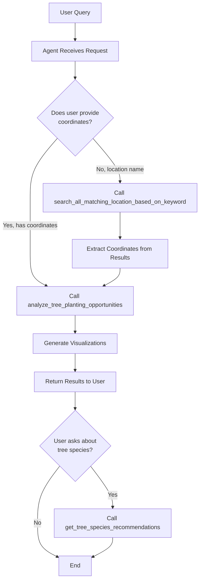

# ReLeaf Agent Workflow: Search → Analyze

## 🔄 Complete Agent Workflow

This document explains how the ReLeaf Agent orchestrates the tree planting analysis workflow by connecting multiple MCP tools.

---

## 📊 Workflow Overview



---

## 🎯 Step-by-Step Workflow

### **Step 1: User Query**
```
User: "Analyze tree planting opportunities near KLCC Park"
```

### **Step 2: Agent Identifies Intent**
The agent (powered by Google ADK) understands:
- User wants to analyze a location
- Location is specified by name ("KLCC Park"), not coordinates
- Need to get coordinates first

### **Step 3: Call Search Tool**
```python
# Agent automatically calls MCP tool #1
search_all_matching_location_based_on_keyword("KLCC Park")
```

**Returns:**
```json
{
  "KLCC Park, Kuala Lumpur, Malaysia": [3.1535, 101.7117],
  "KLCC Convention Centre, KL": [3.1520, 101.7130]
}
```

### **Step 4: Agent Extracts Coordinates**
The agent intelligently:
1. Parses the dictionary response
2. Identifies the best match (first result or most relevant)
3. Extracts the latitude and longitude tuple

```python
# Agent extracts from the dictionary
best_match = "KLCC Park, Kuala Lumpur, Malaysia"
coordinates = results[best_match]  # (3.1535, 101.7117)
latitude = 3.1535
longitude = 101.7117
```

### **Step 5: Call Analysis Tool**
```python
# Agent constructs the second MCP tool call
analyze_tree_planting_opportunities(
    latitude=3.1535,
    longitude=101.7117,
    location_name="KLCC Park"
)
```

### **Step 6: Pipeline Execution (10-25 seconds)**
The analysis tool runs the complete 6-step pipeline:

1. **Download Data**
   - Satellite imagery from Google Maps
   - Buildings from OpenStreetMap
   - Streets from OpenStreetMap
   - Amenities from OpenStreetMap

2. **Align Geometries**
   - Apply KL regional transformation (1.95x scale, -5m N, -10m E)
   - Categorize streets by traffic type

3. **Detect Features**
   - Vegetation detection (NDVI)
   - Shadow detection (sun exposure)

4. **Generate Masks**
   - Building mask
   - Street mask (tiered buffers: 5m-25m)
   - Sidewalk mask

5. **Calculate Priority**
   - Sidewalk proximity: 35 points
   - Building cooling zones: 25 points
   - Sun exposure: 20 points
   - Amenity density: 10 points
   - Total: 0-100 score per pixel

6. **Generate Outputs**
   - 6-panel visualization PNG
   - Component breakdown PNG
   - JSON summary with GPS coordinates

### **Step 7: Tool Returns JSON**
```json
{
  "location": {
    "name": "KLCC Park",
    "coordinates": {"latitude": 3.1535, "longitude": 101.7117}
  },
  "critical_priority_spots": [
    {
      "spot_id": 1,
      "coordinates": {"latitude": 3.1540, "longitude": 101.7120},
      "priority_score": 92.3,
      "area_m2": 45.6,
      "google_street_view_url": "https://www.google.com/maps/@?api=1&map_action=pano&viewpoint=3.1540,101.7120",
      "google_maps_url": "https://www.google.com/maps?q=3.1540,101.7120"
    }
  ],
  "land_coverage": {
    "buildings": {"area_m2": 45123.2, "percentage": 29.4},
    "existing_vegetation": {"area_m2": 32156.8, "percentage": 20.9},
    "plantable_area": {"area_m2": 47374.4, "percentage": 30.8}
  },
  "output_files": {
    "analysis_visualization": "/tmp/tree_analysis_output/klcc_park/klcc_park_analysis.png",
    "component_breakdown": "/tmp/tree_analysis_output/klcc_park/klcc_park_components.png",
    "json_summary": "/tmp/tree_analysis_output/klcc_park/klcc_park_summary.json"
  }
}
```

### **Step 8: Agent Formats Response**
The agent synthesizes the JSON data into a human-friendly response:

```
I've completed a comprehensive tree planting analysis for KLCC Park. Here's what I found:

🎯 CRITICAL PRIORITY AREAS (Score 80-100):
I identified 5 high-priority locations perfect for immediate tree planting:

📍 Spot #1 - Priority Score: 92.3
   Location: 3.1540, 101.7120
   Area: 45.6 m²
   🗺️ View on Street View: [link]
   🗺️ Navigate: [link]

📊 LAND COVERAGE ANALYSIS:
   • Total Area: 153,600 m²
   • Buildings: 29.4%
   • Existing Vegetation: 20.9%
   • Plantable Area: 30.8% (47,374 m²)

📁 VISUALIZATION FILES:
   • Analysis Map: klcc_park_analysis.png
   • Component Breakdown: klcc_park_components.png

Would you like recommendations on which tree species to plant in these areas?
```

### **Step 9 (Optional): Tree Species Recommendations**
If user asks about tree species:
```python
# Agent calls third tool
get_tree_species_recommendations()
```

Returns detailed information on 5 Malaysian tree species suitable for the analyzed areas.

---

## 🤖 How Agent Orchestration Works

The agent doesn't require manual data passing. The **Google ADK framework** handles tool orchestration automatically through:

### **1. Tool Descriptions**
Each MCP tool has a detailed docstring that tells the agent:
- What the tool does
- What parameters it needs
- What it returns

```python
@mcp.tool()
def search_all_matching_location_based_on_keyword(keyword) -> Dict[str, tuple]:
    """
    Search for addresses based on a keyword using Google Geocoding API.
    :param keyword: Search term (e.g., 'Menara LGB', 'KLCC Park')
    :return: Dictionary of {address: (latitude, longitude)}
    """
```

### **2. Agent Instructions**
The agent is configured with instructions in `ReLeaf_Agent/agent.py`:

```python
comprehensive_researcher = Agent(
    name="comprehensive_researcher",
    description="Primary researcher with access to tree planting analysis tools",
    instruction="""
    You are a helpful research assistant for urban tree planting.
    
    You have access to these tools:
    1. search_all_matching_location_based_on_keyword - Find coordinates for locations
    2. analyze_tree_planting_opportunities - Run full geospatial analysis
    3. get_tree_species_recommendations - Get tree species information
    
    WORKFLOW:
    - When user asks to analyze a location BY NAME:
      → First call search tool to get coordinates
      → Then call analysis tool with those coordinates
      
    - When user provides COORDINATES directly:
      → Skip search, call analysis tool directly
      
    - When user asks about TREE SPECIES:
      → Call get_tree_species_recommendations
    
    Always present results in a clear, actionable format with specific GPS coordinates
    and Google Maps links.
    """,
    tools=[mcp_tools, wikipedia_tool]
)
```

### **3. Sequential Agent Flow**
```python
tree_planting_guide_workflow = SequentialAgent(
    name="tree_planting_guide_workflow",
    sub_agents=[
        comprehensive_researcher,  # Gathers all data (calls MCP tools)
        response_formatter,         # Formats the response for users
    ]
)
```

---

## 📝 Example Scenarios

### **Scenario 1: Location by Name**
```
User: "Where should we plant trees near Menara LGB?"

Agent Process:
1. Call search_all_matching_location_based_on_keyword("Menara LGB")
2. Extract: (3.1379, 101.6295)
3. Call analyze_tree_planting_opportunities(3.1379, 101.6295, "Menara LGB")
4. Format and present results
```

### **Scenario 2: Direct Coordinates**
```
User: "Analyze 3.1535, 101.7117"

Agent Process:
1. Skip search (coordinates provided)
2. Call analyze_tree_planting_opportunities(3.1535, 101.7117, "analysis_location")
3. Format and present results
```

### **Scenario 3: Multi-Tool Query**
```
User: "Analyze KLCC Park and tell me what trees to plant"

Agent Process:
1. Call search_all_matching_location_based_on_keyword("KLCC Park")
2. Extract: (3.1535, 101.7117)
3. Call analyze_tree_planting_opportunities(3.1535, 101.7117, "KLCC Park")
4. Call get_tree_species_recommendations()
5. Synthesize both results into comprehensive response
```

---

## 🔑 Key Advantages

✅ **Automatic Orchestration** - Agent decides which tools to call and in what order  
✅ **Smart Parameter Passing** - Agent extracts and transforms data between tool calls  
✅ **Error Handling** - Agent handles failures gracefully (e.g., location not found)  
✅ **Context Awareness** - Agent maintains conversation context across multiple queries  
✅ **Flexible Input** - Accepts location names OR coordinates  

---

## 🚀 Deployment Note

When deployed to Cloud Run:
- MCP Server exposes tools via HTTP
- Agent connects to MCP Server URL
- All orchestration happens server-side
- User just chats naturally with the agent

**No manual tool chaining required!** The Google ADK + MCP architecture handles everything automatically. 🎉
