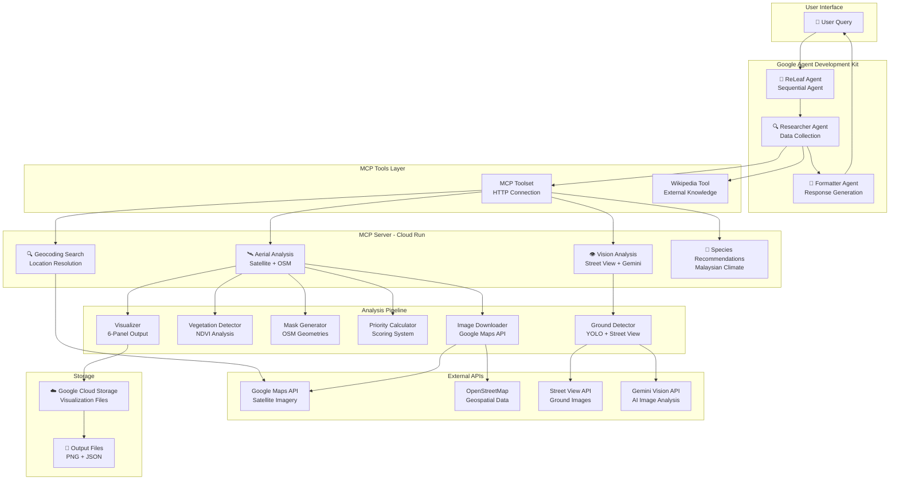

# ReLeaf 🌿

## Agentic AI for Urban Tree Planting

Transforming Carbon Footprints into Climate Action

  Team - ReLeaf the Earth

 
---
layout: center
class: text-center
---

# The Vision 🌍

  ReLeaf transforms Deloitte into a living, breathing example of corporate climate leadership —
  powered by cutting-edge  agentic AI.

  This isn't just sustainability — it's accountability.

---
layout: default
---

# Benefits of Trees 🌳
 

 

 
### Known Ecological Benefits
 

  

    
💨

    

      
Air Pollution Removal

      
Cleaner urban air

    

  

 
  

    
💧

    

      
Stormwater Interception

      
Reduces flooding

    

  

 
  

    
⚡

    

      
Energy Conservation

      
Natural cooling

    

  

 
  

    
🌍

    

      
Carbon Dioxide Storage

      
Climate action

    

  

 

 

 
### Why This Matters
 

  

    
🏥

    

      
Health Benefits

      
Looking at trees reduces stress significantly

    

  

 
  

    
🧘

    

      
Forest Bathing Trend

      
Rising popularity worldwide

    

  

 
  

    
❄️

    

      
Urban Cooling

      
Lowers energy consumption

    

  

 
  

    
🌊

    

      
Flood Alleviation

      
Critical for Malaysia's climate

    

  

 

 

---
layout: default
---

# Why This Analysis is Important 🎯
 

 

 
### Urban Planning Benefits
 

  
💧 Flood Alleviation

  
Strategic tree placement to intercept stormwater and reduce flooding risks

 

  
🚶 Walkable Cities

  
Shade and greenery encourage pedestrian activity and safer streets

 

  
🌍 Air Quality

  
Data-backed decisions to improve urban air quality

 

 

 
### Critical Needs
 

  
🌳 Road Disaster Prevention

  
Proactive measures to prevent tree-related accidents during storms

 

  
⚠️ Pedestrian Safety

  
Trees provide shelter and reduce urban hazards

 

  
🌱 Greener Cities

  
Nature in the city improves wellbeing and lowers stress

 

 

 
---
layout: default
---

# Architecture

---
layout: center
class: text-center
---

# Let's See It In Action 🚀

  

    
🤖 Agent URL:

    
https://releaf-agent-254863210019.us-central1.run.app

    
💬 Try asking:

    
"Analyze tree planting opportunities near Menara LGB"

  

---
layout: default
---

# Business Value for Deloitte 💼

  
🌱

  
Environmental Leadership

  

    
✓ Turn carbon footprint into measurable action

    
✓ Lead by example in sustainability

  

  
💼

  
Client Solutions

  

    
✓ Offer as consulting service

    
✓ New revenue stream opportunity

  

  
🏙️

  
Urban Planning

  

    
✓ Collaborate with city governments

    
✓ Support KL sustainability plans

  

  
📣

  
Brand Differentiation

  

    
✓ Showcase AI innovation in climate tech

    
✓ Sustainability thought leadership

  

---
layout: end
class: text-center
---

# 🌿 ReLeaf

📊 City Councils Can Now Make Data-Backed Decisions 
Moving from intuition to evidence-based urban planning

Turn guilt into measurable action. 
Together, we make Deloitte a living example of corporate climate leadership!