🎯 HEATMAP IS CALCULATED, NOT DOWNLOADED

  What Google/OSM Provide (Raw Data):

  1. Google Maps: Just the satellite image (a picture)
  2. OSM: Just geometry data (building polygons, street lines, amenity points)

  What YOUR System Calculates:

  # Lines 103-109 in priority_calculator.py
  enhanced_priority = (
      sidewalk_score +      # YOU calculate this from OSM streets
      building_score +      # YOU calculate this from OSM buildings
      sun_score +           # YOU calculate this from satellite image
      amenity_score +       # YOU calculate this from OSM amenities
      gap_score             # (reserved, currently zeros)
  )
  # Result: YOUR custom 0-100 heatmap

---
📊 THE COMPLETE DATA FLOW

```mermaid
flowchart TD
      GOOGLE["🛰️ Google Maps API<br/>Provides: Satellite image (pixels)"]
      OSM["🗺️ OpenStreetMap<br/>Provides: Vector geometries"]

      subgraph RAW["RAW DATA (Not a heatmap)"]
          IMG["Satellite Image<br/>640x640 RGB pixels"]
          BLDG["Building Polygons<br/>Lat/lon coordinates"]
          STREETS["Street Lines<br/>Lat/lon + highway types"]
          AMEN["Amenity Points<br/>Lat/lon locations"]
      end

      subgraph CALC["YOUR SYSTEM CALCULATIONS"]
          NDVI["Calculate NDVI<br/>(Green-Red)/(Green+Red)"]
          SHADOW["Calculate Shadows<br/>HSV color analysis"]
          MASK1["Rasterize Buildings<br/>to pixel mask"]
          MASK2["Buffer Streets<br/>5m-25m tiered buffers"]
          DIST1["Distance Transform<br/>pixels to sidewalks"]
          DIST2["Distance Transform<br/>meters to buildings"]
          COUNT["Count Amenities<br/>within 50m radius"]
      end

      subgraph SCORE["SCORING COMPONENTS"]
          S1["Sidewalk Score<br/>0-35 points<br/>Based on distance"]
          S2["Building Score<br/>0-25 points<br/>Based on 5-30m zone"]
          S3["Sun Score<br/>0-20 points<br/>Based on shadow intensity"]
          S4["Amenity Score<br/>0-10 points<br/>Based on density"]
      end

      HEAT["🎨 FINAL HEATMAP<br/>0-100 point scores<br/>Per pixel<br/><br/>THIS IS YOUR CREATION!"]

      GOOGLE --> IMG
      OSM --> BLDG
      OSM --> STREETS
      OSM --> AMEN

      IMG --> NDVI
      IMG --> SHADOW
      BLDG --> MASK1
      STREETS --> MASK2

      MASK2 --> DIST1
      MASK1 --> DIST2
      AMEN --> COUNT

      DIST1 --> S1
      DIST2 --> S2
      SHADOW --> S3
      COUNT --> S4

      S1 --> HEAT
      S2 --> HEAT
      S3 --> HEAT
      S4 --> HEAT

      style RAW fill:#ffe6e6
      style CALC fill:#fff3e0
      style SCORE fill:#e8f5e9
      style HEAT fill:#e1f5ff
```

  ---
  🔍 DETAILED BREAKDOWN

  Component 1: Sidewalk Score (35 points)

  Raw Data from OSM: Street lines with highway tags
  What YOU calculate:
  1. Filter pedestrian streets (footway, path, etc.)
  2. Buffer them 5m in UTM projection
  3. Rasterize to pixel mask
  4. Calculate distance transform (every pixel → nearest sidewalk)
  5. Assign scores based on distance:
     - ≤20 pixels away: 35 points
     - 20-50 pixels: 20 points
     - >50 pixels: 5 points
  Result: YOUR sidewalk score array (640×640)

  Component 2: Building Score (25 points)

  Raw Data from OSM: Building polygons (lat/lon vertices)
  What YOU calculate:
  1. Apply 1.95x scale + offset alignment
  2. Rasterize buildings to pixel mask
  3. Calculate distance transform (in pixels)
  4. Convert to meters (× 0.6m/pixel)
  5. Assign scores based on distance:
     - 5-15m: 25 points (optimal cooling zone)
     - 15-30m: 15 points
     - 0-5m: 10 points (too close)
     - >30m: 5 points
  Result: YOUR building score array (640×640)

  Component 3: Sun Score (20 points)

  Raw Data from Google: RGB satellite image
  What YOU calculate:
  1. Convert RGB to HSV color space
  2. Detect shadows: V<95 AND S<60
  3. Exclude vegetation areas
  4. Calculate shadow intensity: 1.0 - normalized_brightness
  5. Apply Gaussian blur for smooth gradients
  6. Assign scores based on intensity:
     - <0.3 (full sun): 20 points
     - 0.3-0.6 (partial): 12 points
     - ≥0.6 (heavy shade): 5 points
  Result: YOUR sun exposure score array (640×640)

  Component 4: Amenity Score (10 points)

  Raw Data from OSM: Amenity point locations (lat/lon)
  What YOU calculate:
  1. Convert amenity lat/lon to pixel coordinates
  2. For each pixel:
     - Count amenities within 50m radius
     - Apply Gaussian falloff (sigma=25m)
  3. Normalize to 0-10 point scale
  Result: YOUR amenity density score array (640×640)

  ---
  🎨 THE HEATMAP VISUALIZATION

  Panel 5: Priority Heatmap in your output is:
  # In visualizer.py
  plt.imshow(enhanced_priority_score, cmap='viridis')

  This displays YOUR calculated scores (0-100) with colors:
  - Purple/Blue: Low scores (0-40)
  - Green: Medium scores (40-60)
  - Yellow: High scores (60-80)
  - Red: Critical scores (80-100)

  ---
  ✅ KEY INSIGHT

  Google/OSM provide: Raw ingredients 🥕🥔🧅
  Your system does: The cooking 👨‍🍳
  The heatmap is: The final dish 🍲

  Neither Google nor OSM have:

  - ❌ Tree planting priority scores
  - ❌ Combined multi-factor analysis
  - ❌ 100-point scoring system
  - ❌ Critical/High/Medium/Low classifications
  - ❌ Your specific weighting (35/25/20/10)

  This is 100% YOUR algorithm:

  - ✅ The 100-point scoring system
  - ✅ The component weights (35, 25, 20, 10)
  - ✅ The distance thresholds (5-15m, 20-50px, etc.)
  - ✅ The priority classifications (80+, 60-80, 40-60, 0-40)
  - ✅ The heatmap visualization

  ---
  🎯 ANALOGY

  Think of it like cooking:

  Google/OSM = Grocery Store
  - Provides: Tomatoes, meat, spices (raw data)
  - Does NOT provide: A cooked meal

  Your System = Chef
  - Takes raw ingredients
  - Applies recipe (your algorithm)
  - Creates final dish (heatmap)

  The Heatmap = Your Custom Recipe
  - Not available in any store/database
  - Created by YOUR specific cooking method
  - Unique to your system

  ---
  💡 IMPLICATIONS

  This means:

  1. Customizable: You can adjust component weights (change 35→40, etc.)
  2. Proprietary: This is YOUR analysis methodology
  3. Transparent: You know exactly how scores are calculated
  4. Validatable: You can test/verify each component
  5. Improvable: You can refine algorithms over time

  This also means:

  ⚠️ The accuracy depends on YOUR algorithm choices, not Google/OSM
  ⚠️ Different thresholds = different results (e.g., change 5-15m to 10-20m)
  ⚠️ Component weights matter (35 for sidewalks vs 20 for sun exposure)

  ---
  📊 SUMMARY

  | What               | Source      | Type                |
  |--------------------|-------------|---------------------|
  | Satellite image    | Google      | Raw data (input)    |
  | Building polygons  | OSM         | Raw data (input)    |
  | Street lines       | OSM         | Raw data (input)    |
  | Amenity points     | OSM         | Raw data (input)    |
  | HEATMAP SCORES     | YOUR SYSTEM | CALCULATED (output) |
  | Critical spots GPS | YOUR SYSTEM | CALCULATED (output) |
  | Priority levels    | YOUR SYSTEM | CALCULATED (output) |

  Bottom line: Google and OSM provide the puzzle pieces. Your system assembles them into a unique picture (the heatmap) that doesn't exist anywhere else! 🧩→🖼️